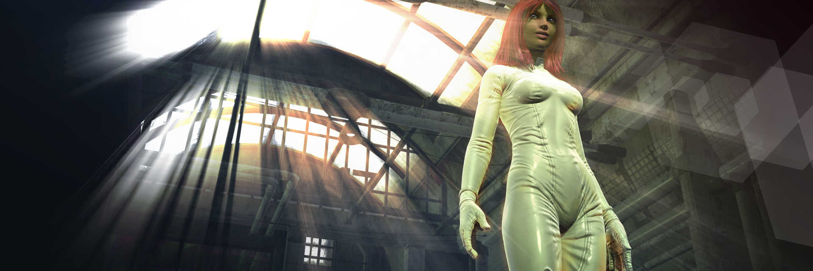

## **Illustrations, Portraits, Cover Art, Etc.**

Hey all! I’m in the process of opening a 3D Content & Art Resources Store at **[DAZ3D](http://www.daz3d.com/shop/)**, but while I’m waiting through the submissions and review process I could use a little paying work to get me by. So, I am taking commissions for art projects: Illustrations, Portraits, Etc., from all comers. You can message me for details if you are interested or would like a quote on a picture you’d like me to create for you.

Illustration is a passion for me, but I am not limited to my own vision and inspiration. If you have an idea for an illustration, or need something something unique for your own website, game or publication, I can help you. You can contact me via email (david.b.roberson@gmail.com) or through any of my social media message channels to get things started.

Every piece of art has its own demands, so pricing is negotiable. I actually offer a number of different services, from illustration, digital photography, photo manipulation (or postwork) and graphic design (logos, title art, ad composition, etc) to writing and web design.

When building a web site, I may need to do all of those things, or I may only do one or two. Creating the things that go on a web page can often be harder than creating the page itself. So, I always try to give people payment options that fit their needs.

Many of my clients have a fixed budget and are only able to pay a flat rate for a specific deliverable (Photoshop 10 photos for $10 apiece, or $50 for a character sketch, or $100 per page of CSS or HTML for a web site). The amount of work for each item varies, and while I will ask for input and feedback to meet the requirements, the actual deliverable can not be changed once I start working.

A client can pay half of the flat rate to cancel a work in progress, and then issue a new deliverable at the established rate. For projects with clear and comprehensive guidelines, flat rates offer the lowest cost in time and money.

In some cases, however, there is no practical way to know how big or challenging a project will be. As a creative person, I fully appreciate the need to revise and reconsider things repeatedly until they are right. For projects that require more flexibility and adaptability, the best option is an hourly rate.

My friends and family discount is $10 an hour--while professional rates start at $20 an hour. By paying for my time, you get the benefit of whatever skills are needed and the option to change directions at will.

I guarantee the quality of my work, so you may wonder "What does that lower rate cost?" I have to be honest: like everyone else, I work to pay the bills, so when I make less, I have to work more. With the high cost of living in my part of California, I can only offer discounts when I have a lot of work coming in.

I do offer first time and "personal interest" discounts, to help struggling clients out or to demonstrate my skills in an area I particularly love or wish to work more in.

After all, one of the main reasons for being a freelance artist is to be able to find interesting jobs doing things I like--such as cover art and feature illustrations--and keep building my portfolio. So, my discount rate applies in situations where the job presents the opportunity to showcase my talent or cultivate future business.

It can also apply to new or small businesses; I am always interested in helping when and where I can, and some of the best opportunities come from struggling and start-up clients. I am willing to work within the budget you can afford, without compromising on quality or professionalism.

\[contact-form\]\[contact-field label="Name" type="name" required="1" /\]\[contact-field label="Email" type="email" required="1" /\]\[contact-field label="Website or Online Reference" type="url" /\]\[contact-field label="Inquiry" type="textarea" required="1" /\]\[/contact-form\]

 

#illustrations #portraits #character art #cover art #album art
